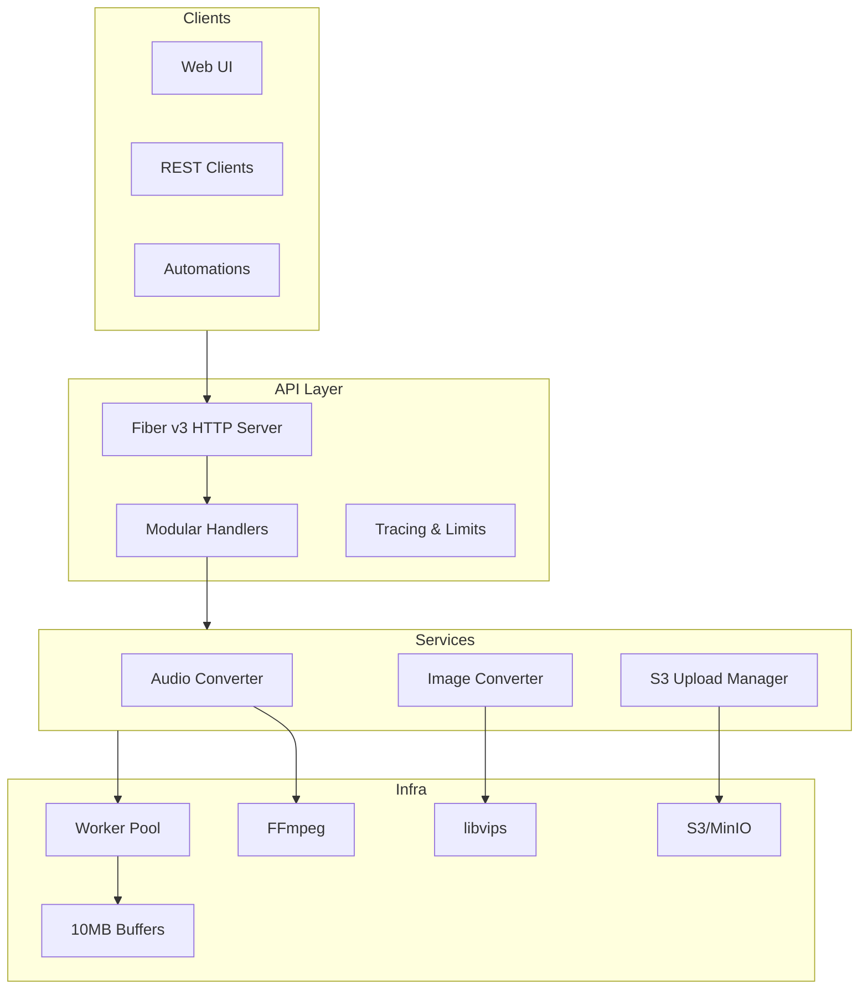

# WhatsApp Media Converter API

High-performance media conversion service designed for WhatsApp-optimised audio, images, and S3 uploads. Built with Go, Fiber v3, FFmpeg, and libvips to sustain >1k requests/second with predictable latency.


---

## Table of Contents

- [WhatsApp Media Converter API](#whatsapp-media-converter-api)
  - [Table of Contents](#table-of-contents)
  - [Features](#features)
  - [Architecture Overview](#architecture-overview)
  - [API Surface](#api-surface)
  - [Configuration](#configuration)
    - [Core Settings](#core-settings)
    - [S3 Provider Settings](#s3-provider-settings)
  - [Quick Start](#quick-start)
    - [Prerequisites](#prerequisites)
    - [Launch with Docker](#launch-with-docker)
    - [Local Go Development](#local-go-development)
    - [Health Check](#health-check)
  - [Development Workflow](#development-workflow)
  - [Testing \& Quality Gates](#testing--quality-gates)
  - [CI/CD \& Automated Releases](#cicd--automated-releases)
    - [Required Repository Secrets](#required-repository-secrets)
  - [Docker Images](#docker-images)
  - [Troubleshooting](#troubleshooting)
  - [Contributing](#contributing)
  - [Community Stats](#community-stats)
    - [⭐ Star History](#-star-history)
    - [👥 Contributors](#-contributors)
  - [License](#license)
  - [Author](#author)

---

## Features

- **Audio → Opus**: Converts any supported format to WhatsApp-compliant Opus containers using FFmpeg.
- **Image Optimisation**: Converts still images to high-quality, compressed JPEG via libvips fallback to FFmpeg.
- **S3 Upload Service**: Unified upload manager with MinIO, AWS S3, Backblaze, and generic-compatible providers.
- **Worker & Buffer Pools**: Deterministic latency under burst loads; configurable via environment variables.
- **Web UI**: Static single-page interface for drag & drop conversions and upload monitoring.
- **Observability**: Health, statistics, and S3 status endpoints for readiness probes and dashboards.
- **Docker Native**: Multi-stage builds and docker-compose profiles for API, monitoring, and development stacks.
- **Automated Releases**: Conventional commit driven versioning, changelog generation, GitHub Releases, and Docker pushes.

---

## Architecture Overview



**Key directories:**

| Path | Purpose |
|------|---------|
| `cmd/api` | Bootstrap Fiber server, inject configuration, start services |
| `internal/config` | Environment parsing and validation |
| `internal/handlers` | REST handlers (conversion, uploads, web assets) |
| `internal/services` | Core conversion flows, S3 service, buffer/work pools |
| `internal/providers` | S3 provider implementations (MinIO, AWS, Backblaze) |
| `web` | Static HTML/CSS/JS front-end distributed with the API |
| `scripts` | Load/stress helpers, benchmarking utilities |
| `docker` | Compose profiles, monitoring stack assets |

---

## API Surface

| Method | Endpoint | Description |
|--------|----------|-------------|
| `POST` | `/convert/audio` | Base64 or URL input → Opus audio data URI |
| `POST` | `/convert/image` | Base64 or URL input → Optimised JPEG data URI |
| `POST` | `/convert/batch/audio` | Batch audio conversion (max 10 items) |
| `POST` | `/convert/batch/image` | Batch image conversion (max 10 items) |
| `POST` | `/upload/s3` | Multipart upload to configured S3 bucket |
| `POST` | `/upload/s3/base64` | Base64 payload upload |
| `GET` | `/upload/s3/status/:id` | Upload status with metrics |
| `GET` | `/upload/s3/list` | Recent uploads (optional status filter) |
| `GET` | `/upload/s3/health` | Provider health check |
| `GET` | `/stats` | Runtime metrics (worker pool, buffer usage, memory) |
| `GET` | `/health` | Readiness / liveness probe |
| `GET` | `/` | Web console |

All endpoints return structured JSON with detailed error messages and progress indicators. Responses include fine-grained metadata such as conversion duration, output size, and S3 URLs when applicable.

---

## Configuration

Create a `.env` file from the template and adjust according to your environment.

```bash
cp .env.example .env
```

### Core Settings

| Variable | Default | Description |
|----------|---------|-------------|
| `PORT` | `8080` | HTTP listen port |
| `MAX_WORKERS` | `32` | Worker pool size |
| `BUFFER_POOL_SIZE` | `100` | Number of pre-allocated buffers |
| `BUFFER_SIZE` | `10485760` (10MB) | Size for each buffer |
| `REQUEST_TIMEOUT` | `5m` | Request deadline enforced by handlers |
| `BODY_LIMIT` | `524288000` (500MB) | Max request body size |

### S3 Provider Settings

| Variable | Notes |
|----------|-------|
| `S3_ENABLED` | `true/false` toggle |
| `S3_PROVIDER` | `minio`, `aws`, `backblaze`, ... |
| `S3_ENDPOINT`, `S3_REGION`, `S3_BUCKET` | Provider connection details |
| `S3_ACCESS_KEY`, `S3_SECRET_KEY` | Credentials (consider secrets) |
| `S3_PATH_STYLE` | Force path-style URLs for MinIO |
| `S3_PUBLIC_READ` | Automatically set objects to public |
| `S3_MAX_CONCURRENT_UPLOADS` | Cap simultaneous uploads |
| `S3_CHUNK_SIZE`, `S3_MULTIPART_THRESHOLD` | Multipart tuning |

The S3 upload handler buffers multipart files in-memory to guarantee deterministic retries and avoid partial uploads when the provider issues retries.

---

## Quick Start

### Prerequisites

- Docker 24+
- Docker Compose v2+
- FFmpeg and libvips when running locally (`make install-deps-mac` or `make install-deps-ubuntu`)

### Launch with Docker

```bash
make docker-run
# API available at http://localhost:8080
# Web UI available at http://localhost:8080/
```

### Local Go Development

```bash
make deps
make run
```

### Health Check

```bash
curl http://localhost:8080/health
```

---

## Development Workflow

| Command | Description |
|---------|-------------|
| `make help` | List available commands |
| `make run` | Start API locally |
| `make dev` | Run with hot reload (requires [`air`](https://github.com/cosmtrek/air)) |
| `make test` | Run unit and integration tests with race detector |
| `make docker-build` | Build container image locally |
| `make docker-run` | Start docker-compose API stack |
| `make monitoring-up` | Bring up Prometheus & Grafana profile |

The Makefile reads the version from the `VERSION` file, which is maintained by the release automation.

---

## Testing & Quality Gates

1. `make test` — run Go tests (`./...`) with `-race` and coverage.
2. `make lint` — execute `golangci-lint` to enforce formatting and idiomatic Go.
3. `go test` is executed on CI for every pull request and push to `main`.
4. Optional: `make benchmark`, `make load-test`, and `make stress-test` for performance validation.
5. Static analysis (`golangci-lint`) is no longer bundled in the Makefile because upstream releases are currently incompatible with Go 1.25. Run it via a pre-built binary or container if needed.

---

## CI/CD & Automated Releases

The repository ships with two primary GitHub Actions workflows:

1. **`ci.yml`** — Lints, tests, and builds the project on every PR and push.
2. **`release.yml`** — Runs on pushes to `main` using [Semantic Release](https://semantic-release.gitbook.io/) to:
   - Infer the next semantic version from commit messages (Conventional Commits).
   - Update `CHANGELOG.md` and `VERSION`, committing them back to `main`.
  - Create a Git tag (`vX.Y.Z`) and GitHub Release with generated notes.
   - Build and push multi-architecture Docker images tagged with the version and `latest` to:
     - `ghcr.io/<owner>/<repo>` (using the default `GITHUB_TOKEN`).
     - Docker Hub (optional) when `DOCKERHUB_USERNAME` & `DOCKERHUB_TOKEN` secrets are provided.

### Required Repository Secrets

| Secret | Description |
|--------|-------------|
| `DOCKERHUB_USERNAME` | *(Optional)* Docker Hub account name for publishing images. |
| `DOCKERHUB_TOKEN` | *(Optional)* Docker Hub personal access token. |

No additional configuration is required for GHCR — the workflow authenticates with `GITHUB_TOKEN`.

To trigger a release, merge commits into `main` following the [Conventional Commits](https://www.conventionalcommits.org/) specification (`feat:`, `fix:`, `chore:`, etc.). Semantic Release determines the bump (major/minor/patch) automatically.

---

## Docker Images

Images are built from the provided `Dockerfile` and contain:

- Distroless-alpine runtime stage<br>
- Statically compiled Go binary (`media-converter`)
- Pre-bundled static web assets (`web/*`)

Tags published:

- `ghcr.io/guilhermejansen/whats-convert-api:latest`
- `ghcr.io/guilhermejansen/whats-convert-api:vX.Y.Z`
- `guilhermejansen/whats-convert-api:latest` *(when Docker Hub secrets configured)*
- `guilhermejansen/whats-convert-api:vX.Y.Z`

---

## Troubleshooting

| Symptom | Resolution |
|---------|------------|
| `http: ContentLength ... Body length 0` during uploads | Ensure MinIO/S3 credentials are valid; the upload manager buffers and retries with deterministic readers |
| `libvips` or `ffmpeg` missing | Install via `make install-deps-mac` or `make install-deps-ubuntu`, or rely on Docker runtime |
| High latency under load | Tune `MAX_WORKERS`, `BUFFER_POOL_SIZE`, and `BUFFER_SIZE`; monitor `/stats` |
| Release workflow fails on Docker push | Verify Docker Hub secrets and that the account has repository permissions |

---

## Contributing

1. Fork the repository & clone locally.
2. Create a feature branch (`git checkout -b feat/add-awesome-thing`).
3. Follow the coding standards (Go fmt, idiomatic naming, contextual logging).
4. Write tests alongside features or fixes when feasible.
5. Commit using Conventional Commits.
6. Open a pull request using the provided template — include test output and reproduction steps.

Issue templates for bug reports and feature requests are located in `.github/ISSUE_TEMPLATE/`.

---

## Community Stats

### ⭐ Star History

[](https://star-history.com/#guilhermejansen/whats-convert-api)

### 👥 Contributors

[](https://github.com/guilhermejansen/whats-convert-api/graphs/contributors)

---

## License

Released under the [MIT License](./LICENSE) © 2025 Guilherme Jansen.

--- 

## Author

Guilherme Jansen [Github](https://github.com/guilhermejansen)
